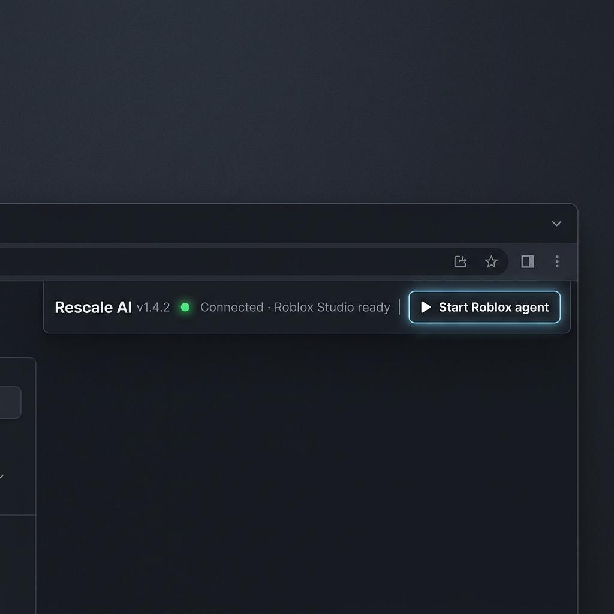
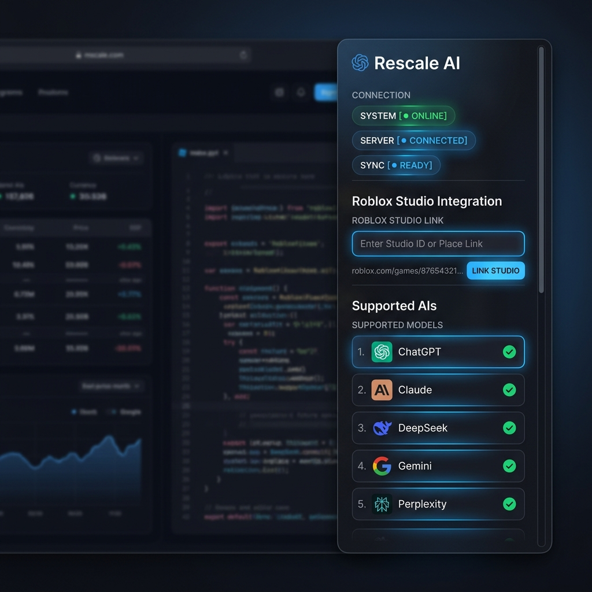

# 💎 Rescale AI × Roblox Studio Agent

🤖 **Rescale AI** is a free browser extension that turns popular AI chat interfaces (like ChatGPT, Claude, DeepSeek, Gemini, Perplexity, and others) into an advanced **Roblox Studio AI Agent**.

Control Roblox Studio directly from your favorite AI chat window in your browser—read/edit scripts, run Luau code, generate assets, and browse the creator store. No API keys, no complicated command line tools, and no coding knowledge needed!

🌐 **Website:** [rescale-ai-five.vercel.app](https://rescale-ai-five.vercel.app) (The premium, free alternative for building Roblox games with AI).

---

## 📸 Visual Showcase

### 💬 Chat Extension Status Bar (In-Flow Chat Overlay)

### 🗺️ Global Sidebar Widget (All-Site Dashboard)

---

## 🚀 Key Features

* 📝 **Read & Edit Scripts:** The AI can view, write, and modify scripts directly inside your Roblox Studio workspace.
* ⚙️ **Execute Luau Code:** Run code live in the Studio console to test scripts, spawn objects, or modify variables.
* 🌳 **Game Tree Inspector:** Let the AI inspect your workspace hierarchy, find instances, and analyze structure.
* 🎨 **Asset Generation:** Generate meshes, materials, and 3D models using AI generation tools.
* 🔍 **Creator Store Integration:** Search the official Toolbox / Creator Store and import models/scripts.
* 💾 **Persistent Workspace Memory:** Rescale AI saves context directly into your place file so it remembers your game structure across chats.
* 🌐 **Global Browser Widget:** A floating helper bubble on non-chat websites that acts as your status dashboard and AI router.

---

## 🔌 Supported AI Platforms

Rescale AI injects its premium control bar directly into the following AI interfaces:

| AI Platform | Website | Status / Recommendation |
| :--- | :--- | :--- |
| 🚀 **DeepSeek** | [chat.deepseek.com](https://chat.deepseek.com) | **Recommended!** (Most stable tool usage) |
| 🔮 **Claude** | [claude.ai](https://claude.ai) | **Excellent** (Native in-flow support) |
| 💬 **ChatGPT** | [chatgpt.com](https://chatgpt.com) | **Excellent** (Supports both editor formats) |
| ⚡ **Perplexity** | [perplexity.ai](https://www.perplexity.ai) | **Great** (Combines search + Roblox control) |
| 🌟 **Google Gemini** | [gemini.google.com](https://gemini.google.com) | **Good** (Can sometimes drop tool usage in long chats) |
| 🍃 **Kimi** | [kimi.com](https://www.kimi.com) | **Good** (Supports Moonshot AI) |
| 🌊 **Qwen** | [chat.qwen.ai](https://chat.qwen.ai) | **Good** (Alibaba's advanced model) |
| 🌌 **GLM (Z.ai)** | [chat.z.ai](https://chat.z.ai) | **Good** (Zhipu AI) |
| 🏆 **LMSYS Arena** | [arena.ai](https://arena.ai) | **Good** (Use **Direct** mode only) |

---

## 🛠️ Step-by-Step Onboarding

### 1️⃣ Download & Install the Extension
1. Download the latest release files from the repository.
2. In your browser (Chrome or Edge), go to:
   - Chrome: `chrome://extensions/`
   - Edge: `edge://extensions/`
3. Toggle **Developer mode** on (top-right corner).
4. Click **Load unpacked** (Load entpackte Erweiterung) in the top-left corner.
5. Select the `rescale-ai-extension` folder.

### 2️⃣ Configure Roblox Studio
1. Open **Roblox Studio** and load your game/project file.
2. Enable the MCP server (first time setup):
   - Click the **Assistant AI** tab in the top bar.
   - Click the three dots `...` in the top right of the Assistant panel.
   - Click **Manage MCP Servers**.
   - Enable **Enable Studio as MCP Server**.

### 3️⃣ Start the Bridge
1. Double-click the **`start.bat`** file in the project folder.
2. Keep this terminal window open/minimized while working. It bridges the browser extension to Roblox Studio.

### 4️⃣ Start Coding!
1. Go to any supported AI chat (e.g., [DeepSeek](https://chat.deepseek.com) or [Claude](https://claude.ai)).
2. The sleek, dark Rescale AI status bar will appear above the text input field.
3. Click **Start Roblox agent** and begin prompting!

---

## 🟢 Status Indicators (Extension Bar)

The status dot on the Rescale AI bar tells you if the agent is ready to receive commands:

| Indicator | Status | Action Required |
| :---: | :--- | :--- |
| 🟢 **Green** | **Ready** | Bridge & Roblox Studio are connected and a place is open. Ready to work! |
| 🟡 **Yellow** | **Studio Disconnected** | Bridge is running, but Studio is closed, place is closed, or MCP is disabled. Open a place or check settings. |
| 🔘 **Grey** | **Bridge Offline** | The local bridge is not running. Double-click `start.bat` to launch it. |

---

## 🤝 Community & Support

> [!IMPORTANT]
> ⚠️ **Need Help & Support?** If you run into any issues during installation, need setup assistance, or want to report a bug, please join our official **[Support Discord Server](https://discord.gg/u6psyA7sta)**! We are active and ready to help you get everything running smoothly.

💬 Join us on **[Discord](https://discord.gg/u6psyA7sta)** to:
- 🛠️ Get setup assistance and troubleshoot errors.
- 💡 Suggest new features and improvements.
- 📣 Stay updated on the latest releases and news.
- 🎮 Share your creations and collaborate with other developers.

---

*Credit: The architecture for side-loading additional MCP servers (like Blender or Sketchfab) alongside Roblox Studio is based on an idea by [javnpa](https://github.com/javnpa).*
